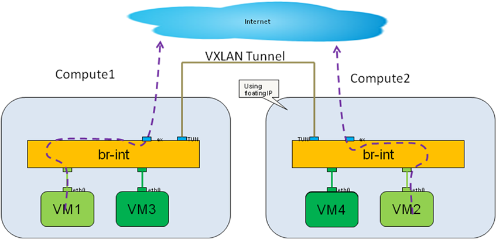

========================
Release notes for onosfw
========================

.. contents:: Table of Contents
   :backlinks: none

Abstract
========

This document describes the currently supported ONOSFW test scenarios for both bare metal and virtual deployments

License
=======
.. This work is licensed under a Creative Commons Attribution 4.0 International License.
.. http://creativecommons.org/licenses/by/4.0
.. (c) Lucius (HUAWEI)

Version history
===============

+------------+----------+------------+------------------+
| **Date**   | **Ver.** | **Author** | **Comment**      |
|            |          |            |                  |
+------------+----------+------------+------------------+
| 2016-08-11 | 0.0.1    | Lucius     | First draft      |
|            |          | (HUAWEI)   |                  |
+------------+----------+------------+------------------+
| 2017-02-15 | 1.0.0    | Bob        | For Danube 1.0   |
|            |          | (HUAWEI)   |                  |
+-------------------------------------------------------+

Introduction
============

ONOSFW integrates ONOS SDN controller for OPNFV defined NFVI and VIM. ONOSFW scenarios are defined test cases for target applications that ONOS supports.
Serveral test scebarios has been implemented and integrated for the previous releases. In the Danube release, those scenarios are maintained for the current versions
of Openstack and ONOS. While no new scenario is implemented in this release, new features in the current ONOS release can still be explored by interested users.
For the complete list of new ONOS features, please refer to ONOS release home page.

The following is a list of current supported test scenarios.

ONOSFW Test Scenarios
=====================

Currently Openstack and ODL are using Centralized gateway to reach external network.ONOS takes a different approach, it uses DVR mode, where each compute node has the ability to reach external network, as illustrated below:

Secenario 14 ONOS-SFC-HA :
----------------------
1. SFC feature

   3.1 Infrastructure CURD operation of SFC.

   3.2 traffic through SFC

Revision: _sha1_

:Author: Lucius(lukai1@huawei.com)

Build date: |today|
